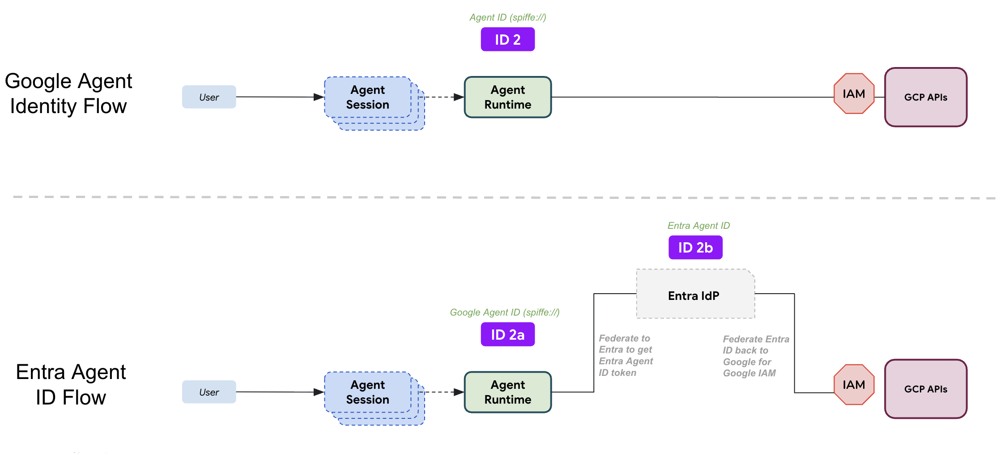

summary: Learn how to integrate Microsoft Entra Agent ID with Google Cloud Agent Runtime and Workload Identity Federation for cross-cloud enterprise agent governance.
id: entra-agent-id-gemini-platform
categories: AI, Security, Multi-Cloud
tags: ADK, Agent Runtime, Entra ID, Identity, Cloud Storage, WIF
status: Published
authors: Google Cloud & Microsoft Entra Integration Team
Feedback Link: https://github.com/egonzalezpozega/agent-platform-entra-id/issues

# Multi-Cloud Agent Governance: Integrating Microsoft Entra Agent ID with Agent Platform

## Overview
Duration: 0:05:00

Enterprise AI agents require robust identity, authentication, and governance. When agents perform autonomous actions across multi-cloud environments—such as accessing enterprise documents in Google Cloud Storage while being governed by enterprise policies in Microsoft Entra—a unified, secret-free identity architecture is critical.

This codelab guides you through integrating **Microsoft Entra Agent ID** with **Agent Platform** (using the Agent Development Kit - ADK and Agent Runtime).

### What You Will Build
In this codelab, you will build and deploy a pure Python ADK agent that:
1. Runs inside **Agent Runtime** with native **Agent Identity**.
2. Obtains a cryptographically verified **Google Agent Runtime SPIFFE assertion**.
3. Federates with **Microsoft Entra ID** using the official [Microsoft Entra Autonomous App OAuth Flow](https://learn.microsoft.com/en-us/entra/agent-id/agent-autonomous-app-oauth-flow) (leveraging [RFC 7523](https://datatracker.ietf.org/doc/html/rfc7523) for JWT Bearer Client Authentication and [RFC 8693](https://datatracker.ietf.org/doc/html/rfc8693) for Token Exchange) to acquire an enterprise **Entra Agent ID token**.
4. Exchanges the Entra token back with **Google Cloud Workload Identity Federation (WIF / STS)**.
5. Accesses, lists, and reads enterprise documents from **Google Cloud Storage** under the fine-grained IAM principal of the Microsoft Entra Agent Identity.

### What You Will Learn
* How the **External Agent Identity** pattern works across Google Cloud and Microsoft Entra.
* How to configure Federated Identity Credentials (FIC) in Microsoft Entra Agent ID without static secrets.
* How the Entra [Autonomous App OAuth Flow](https://learn.microsoft.com/en-us/entra/agent-id/agent-autonomous-app-oauth-flow) ([RFC 7523](https://datatracker.ietf.org/doc/html/rfc7523) / [RFC 8693](https://datatracker.ietf.org/doc/html/rfc8693)) and **Google STS WIF** work together.

---

## Architecture & Identity Topology
Duration: 0:05:00

### The Multi-Cloud Identity Architecture

The diagram below illustrates the two primary identity execution paths for AI agents running on Google Cloud:



### Choosing Your Identity Flow

* **Flow 1: Native Google Cloud Agent Identity (Top Flow)**
  * When agents operate purely within Google Cloud, the agent boots with Agent Runtime's native cryptographic SPIFFE identity (`spiffe://...`) and directly requests authorization from Google Cloud IAM. This is the standard, most common flow for native GCP workloads.
* **Flow 2: Bringing External Agent Identities via Microsoft Entra ID (Bottom Flow - Focus of this Codelab)**
  * For enterprise organizations with centralized multi-cloud governance in Microsoft Entra, this codelab focuses on bringing external Agent Identities from **Microsoft Entra Agent ID**. The agent bootstraps on Agent Runtime using its Google assertion, federates outward to establish its autonomous identity in Microsoft Entra, and then federates back into Google Cloud Workload Identity Federation (WIF) so that all Google Cloud IAM decisions (Cloud Storage access) are governed under the Microsoft Entra Agent Identity.

### Identity Flow Breakdown

1. **Bootstrap Runtime Identity:**
   * Agent Runtime generates a cryptographic SPIFFE OIDC assertion representing the agent instance:
     ```text
     spiffe://agents.global.org-<org-id>.system.id.goog/
       resources/aiplatform/projects/<project-num>/
       locations/<region>/reasoningEngines/<id>
     ```
2. **Entra Autonomous Token Exchange (Federated Agent Identity):**
   * **Stage 1 (T1):** The parent **Agent Blueprint** presents the Google SPIFFE assertion to Entra's `/token` endpoint with `scope=api://AzureADTokenExchange/.default` and `fmi_path=<AgentIdentityId>`. Entra validates the Federated Identity Credential (FIC) trust and returns an exchange token T1.
   * **Stage 2 (TR):** The child **Agent Identity** uses T1 as a client assertion to obtain its autonomous enterprise identity token.
3. **Google STS Workload Identity Federation:**
   * The agent presents the Entra ID token to Google Security Token Service (STS). Google STS cryptographically validates the token against Entra's public OIDC discovery endpoint:
     ```text
     https://login.microsoftonline.com/<tenant_id>/v2.0
     ```
4. **Target Resource IAM Authorization:**
   * Google STS returns short-lived Google Cloud OAuth2 credentials mapped to:
     ```text
     principal://iam.googleapis.com/projects/<project-num>/
       locations/global/workloadIdentityPools/entra-agent-pool/
       subject/<entra-agent-object-id>
     ```
   * Google Cloud IAM authorizes Cloud Storage access solely for this Entra principal.

---

## Prerequisites & Environment Setup
Duration: 0:05:00

### 1. Google Cloud Environment
* A Google Cloud Project with billing enabled (e.g., `my-agent-entra-project`).
* `gcloud` CLI installed and authenticated:
  ```bash
  gcloud auth login
  gcloud auth application-default login
  ```

### 2. Microsoft Entra Tenant
* Access to a Microsoft Entra ID tenant with the **Microsoft Entra Agent ID (Preview)** feature enabled.
* Permissions to create **Agent Blueprints** and **Agent Identities** (or Application Administrator / Cloud Application Administrator roles).

### 3. Local Development Tools
* Python 3.11+
* `uv` fast Python package manager:
  ```bash
  curl -LsSf https://astral.sh/uv/install.sh | sh
  ```
* Google `agents-cli`:
  ```bash
  uv tool install google-agents-cli
  ```

---

## Create Microsoft Entra Agent Blueprint & Identity (Manual Setup)
Duration: 0:05:00

In this step, configure Microsoft Entra ID in the Microsoft Entra Admin Center to instantiate the parent Blueprint and the child Agent Identity.

### 1. Create the Agent Blueprint in Microsoft Entra Admin Center

1. Navigate to **Microsoft Entra Admin Center** &rarr; **Agents** &rarr; **Agent blueprints**.
2. Click **+ New agent blueprint**.
3. Set the name to `Gemini-Entra-Agent-Blueprint`.
4. Under **Supported account types**, select **Accounts in this organizational directory only (Single tenant)**.
5. Note the generated **Application (client) ID** (e.g. `a46680b6-9643-4c22-af5e-e9e7303a6471`).

### 2. Instantiate the Child Agent Identity

1. In the left navigation, select **Agents** &rarr; **Agent identities**.
2. Click **+ New agent identity**.
3. Select `Gemini-Entra-Agent-Blueprint` as the parent blueprint.
4. Name the identity `Gemini-Entra-Agent-ID`.
5. Once created, note the **Object ID** of the Agent Identity (e.g., `e5a1e0b3-ed9c-4fa4-84cb-050128d063a8`).

---

## One-Click Deploy (Google Cloud Components)
Duration: 0:05:00

We provide an automated, one-click deployment solution that handles all Google Cloud components with a single command.

The deployment script automatically:
1. Enables required Google Cloud APIs (`aiplatform`, `iam`, `sts`, `storage`).
2. Configures the **Workload Identity Federation (WIF)** Pool and OIDC Provider for your Entra Tenant.
3. Provisions demo **Cloud Storage** bucket with enterprise documents.
4. Grants fine-grained IAM permissions (`roles/storage.objectViewer`) to your **Microsoft Entra Agent Identity Object ID**.
5. Updates configuration files (`.env` and `agents-cli-manifest.yaml`).
6. Deploys the agent directly to **Agent Runtime** with native **Agent Identity**.


Execute the included automated deployment script:

```bash
chmod +x scripts/deploy_all.sh
./scripts/deploy_all.sh
```

The script will prompt for your IDs if not already set in `.env`:
* Google Cloud Project ID
* Microsoft Entra Tenant ID
* Microsoft Entra Blueprint Application (Client) ID
* Microsoft Entra Agent Identity Object ID

Once deployment completes, note the **Reasoning Engine ID** (or Reasoning Engine URI) displayed at the end of the script output.

---

## Configure Federated Identity Credential in Microsoft Entra
Duration: 0:05:00

Now that the agent is deployed on Google Cloud Agent Runtime and you have your **Reasoning Engine ID**, establish the cryptographic trust link between Google Agent Runtime and Microsoft Entra.

### 1. Collect Google Cloud Identifiers

Run the following `gcloud` commands in your terminal to retrieve your Organization ID, Project Number, and Reasoning Engine ID:

```bash
# Get your Google Cloud Organization ID
gcloud projects describe $(gcloud config get-value project) --format="value(parent.id)"

# Get your Google Cloud Project Number
gcloud projects describe $(gcloud config get-value project) --format="value(projectNumber)"

# Get your Reasoning Engine ID
gcloud ai reasoning-engines list \
  --region=us-central1 \
  --project=$(gcloud config get-value project) \
  --format="value(name)" \
  --limit=1 | awk -F'/' '{print $NF}'
```

### 2. Add Federated Identity Credential (FIC) to the Blueprint

1. In **Microsoft Entra Admin Center**, navigate to **Agents** &rarr; **Agent blueprints** and select `Gemini-Entra-Agent-Blueprint`.
2. In the Blueprint overview, select **Certificates & secrets** &rarr; **Federated credentials**.
3. Click **+ Add credential** and select **Other issuer**.
4. Fill in the trust parameters:
   * **Issuer:**
     <p><code>https://sts.googleapis.com/v1/organizations/<span style="color: #d93025; font-weight: bold;">&lt;your-google-org-id&gt;</span>/locations/global/workloadIdentityPools/agents.global.org-<span style="color: #d93025; font-weight: bold;">&lt;your-google-org-id&gt;</span>.system.id.goog</code></p>
   * **Subject identifier:**
     <p><code>spiffe://agents.global.org-<span style="color: #d93025; font-weight: bold;">&lt;your-google-org-id&gt;</span>.system.id.goog/resources/aiplatform/projects/<span style="color: #d93025; font-weight: bold;">&lt;your-project-number&gt;</span>/locations/us-central1/reasoningEngines/<span style="color: #d93025; font-weight: bold;">&lt;your-reasoning-engine-id&gt;</span></code></p>
   * **Audience:** `api://AzureADTokenExchange`
   * **Name:** `GoogleAgentRuntimeTrust`
5. Click **Save**.

---

## Understanding Workload Identity Federation & IAM (For Review)
Duration: 0:05:00

> **Note:** *For your review only, this is automatically deployed by the script.*

The following section explains the underlying Google Cloud WIF configuration provisioned during the automated deployment.

### 1. Workload Identity Pool

A dedicated pool is created to hold federated identities:
```bash
gcloud iam workload-identity-pools create entra-agent-pool \
  --location=global \
  --display-name="Entra Agent ID Pool" \
  --description="Workload Identity Pool for Microsoft Entra Agent ID federation" \
  --project=$GCP_PROJECT_ID
```

### 2. OIDC Provider Configuration

The provider trusts Microsoft Entra ID's v2.0 OIDC issuer endpoint:

```bash
AUDIENCES="fb60f99c-7a34-4190-8149-302f77469936"
AUDIENCES+=",api://AzureADTokenExchange"
AUDIENCES+=",https://graph.microsoft.com"
AUDIENCES+=",00000003-0000-0000-c000-000000000000"
AUDIENCES+=",${ENTRA_CLIENT_ID}"
AUDIENCES+=",api://${ENTRA_CLIENT_ID}"

MAPPINGS="google.subject=assertion.sub"
MAPPINGS+=",attribute.tid=assertion.tid"
MAPPINGS+=",attribute.oid=assertion.oid"
MAPPINGS+=",attribute.appid=assertion.appid"
MAPPINGS+=",attribute.agent_id=assertion.sub"

gcloud iam workload-identity-pools providers create-oidc entra-oidc-provider \
  --workload-identity-pool=entra-agent-pool \
  --location=global \
  --display-name="Microsoft Entra IdP Provider" \
  --issuer-uri="https://login.microsoftonline.com/${ENTRA_TENANT_ID}/v2.0" \
  --allowed-audiences="${AUDIENCES}" \
  --attribute-mapping="${MAPPINGS}" \
  --attribute-condition="assertion.tid == '${ENTRA_TENANT_ID}'" \
  --project=$GCP_PROJECT_ID
```

### 3. Granular IAM Policy Bindings

Permissions are bound strictly to the Entra Agent Principal:

```bash
POOL_PATH="projects/${GCP_PROJECT_NUMBER}/locations/global/workloadIdentityPools/entra-agent-pool"
ENTRA_PRINCIPAL="principal://iam.googleapis.com/${POOL_PATH}/subject/${ENTRA_AGENT_OBJECT_ID}"

# Cloud Storage Access
gcloud projects add-iam-policy-binding $GCP_PROJECT_ID \
  --member="${ENTRA_PRINCIPAL}" \
  --role="roles/storage.objectViewer"
```

---

## Understanding ADK Agent Code & Token Adapters (For Review)
Duration: 0:06:00

> **Note:** *For your review only, this is automatically deployed by the script.*

The ADK agent implementation includes token exchange modules and custom Google credentials providers.

### 1. Entra Autonomous Token Exchange (`agent/auth/entra_exchange.py`)

Implements the 2-step [Autonomous App OAuth Flow](https://learn.microsoft.com/en-us/entra/agent-id/agent-autonomous-app-oauth-flow) ([RFC 7523](https://datatracker.ietf.org/doc/html/rfc7523)) specified in Microsoft Entra documentation:

```python
import logging
from typing import Dict, Any, Optional
import requests

logger = logging.getLogger(__name__)

def exchange_google_for_entra_token(
    google_assertion: str,
    tenant_id: str,
    client_id: str,
    agent_identity_id: Optional[str] = None,
    scope: Optional[str] = None,
) -> Dict[str, Any]:
    """Exchanges Google SPIFFE assertion for an Entra Agent ID token via Autonomous App Flow."""
    token_url = f"https://login.microsoftonline.com/{tenant_id}/oauth2/v2.0/token"
    headers = {
        "Content-Type": "application/x-www-form-urlencoded",
        "Accept": "application/json",
    }

    # Step 1: Blueprint requests T1 exchange token with fmi_path
    step1_payload = {
        "grant_type": "client_credentials",
        "client_id": client_id,
        "scope": "api://AzureADTokenExchange/.default",
        "client_assertion_type": "urn:ietf:params:oauth:client-assertion-type:jwt-bearer",
        "client_assertion": google_assertion,
    }
    if agent_identity_id:
        step1_payload["fmi_path"] = agent_identity_id

    res1 = requests.post(token_url, data=step1_payload, headers=headers, timeout=10)
    res1.raise_for_status()
    t1_token = res1.json()["access_token"]

    if not agent_identity_id:
        return res1.json()

    # Step 2: Agent Identity requests resource token using T1
    effective_scope = scope or "api://AzureADTokenExchange/.default"
    step2_payload = {
        "grant_type": "client_credentials",
        "client_id": agent_identity_id,
        "scope": effective_scope,
        "client_assertion_type": "urn:ietf:params:oauth:client-assertion-type:jwt-bearer",
        "client_assertion": t1_token,
    }

    res2 = requests.post(token_url, data=step2_payload, headers=headers, timeout=10)
    res2.raise_for_status()
    return res2.json()
```

### 2. Google STS Token Exchange (`agent/auth/google_sts.py`)

Exchanges the Entra token back with Google STS:

```python
import requests

def exchange_entra_for_google_sts_token(
    entra_token: str,
    project_number: str,
    pool_id: str,
    provider_id: str,
) -> dict:
    """Exchanges an Entra ID token for a Google STS access token."""
    sts_url = "https://sts.googleapis.com/v1/token"
    audience = (
        f"//iam.googleapis.com/projects/{project_number}/"
        f"locations/global/workloadIdentityPools/{pool_id}/"
        f"providers/{provider_id}"
    )

    payload = {
        "audience": audience,
        "grant_type": "urn:ietf:params:oauth:grant-type:token-exchange",
        "requested_token_type": "urn:ietf:params:oauth:token-type:access_token",
        "scope": "https://www.googleapis.com/auth/cloud-platform",
        "subject_token_type": "urn:ietf:params:oauth:token-type:jwt",
        "subject_token": entra_token,
    }

    response = requests.post(sts_url, data=payload, timeout=10)
    response.raise_for_status()
    return response.json()
```

### 3. Custom Google Auth Credentials Provider (`agent/auth/credentials.py`)

Wraps the federation workflow in a standard `google.auth.credentials.Credentials` object:

```python
import google.auth.credentials
from google.auth.transport import Request

class EntraFederatedCredentials(google.auth.credentials.Credentials):
    def refresh(self, request: Request) -> None:
        # 1. Acquire Google SPIFFE assertion
        bootstrap_token = get_google_bootstrap_token()
        
        # 2. Federate to Microsoft Entra
        entra_res = exchange_google_for_entra_token(
            google_assertion=bootstrap_token,
            tenant_id=settings.entra_tenant_id,
            client_id=settings.entra_client_id,
            agent_identity_id=settings.entra_agent_object_id,
            scope=settings.entra_scope,
        )
        
        # 3. Exchange Entra token with Google STS
        sts_res = exchange_entra_for_google_sts_token(
            entra_token=entra_res["access_token"],
            project_number=settings.gcp_project_number,
            pool_id=settings.wif_pool_id,
            provider_id=settings.wif_provider_id,
        )
        self.token = sts_res["access_token"]
```

---

## Test & Verify End-to-End Execution
Duration: 0:04:00

Now invoke the live deployed agent to verify the entire multi-cloud identity flow.

### 1. Retrieve the Reasoning Engine Endpoint

You can obtain the `REASONING_ENGINE_URL` in either of two ways:

* **From the Deployment Output:** At the end of `./scripts/deploy_all.sh` or `agents-cli deploy`, the terminal prints the Reasoning Engine URI.
* **Programmatically via `gcloud`:**

```bash
REASONING_ENGINE_ID=$(gcloud ai reasoning-engines list \
  --region=us-central1 \
  --project=$GCP_PROJECT_ID \
  --format="value(name)" \
  --limit=1 | awk -F'/' '{print $NF}')

GCP_PROJECT_NUMBER=$(gcloud projects describe $GCP_PROJECT_ID \
  --format="value(projectNumber)")

REASONING_ENGINE_URL="https://us-central1-aiplatform.googleapis.com/v1/projects/${GCP_PROJECT_NUMBER}/locations/us-central1/reasoningEngines/${REASONING_ENGINE_ID}"
echo "Target Endpoint: $REASONING_ENGINE_URL"
```

### 2. Run Live Test with `agents-cli run`

```bash
agents-cli run \
  --url "${REASONING_ENGINE_URL}" \
  --mode adk \
  "Inspect your active identity, list documents from Cloud Storage, and read 'sales_audit_2026.txt'."
```

### 3. Expected Agent Output

```text
[user]: Inspect your active identity, list documents from Cloud Storage, and read 'sales_audit_2026.txt'.

[agent_platform_entra_id]: Here are the results of your requests:

**Agent Identity Inspection:**
* Status: Verified
* Active GCP Principal: principal://iam.googleapis.com/projects/.../workloadIdentityPools/entra-agent-pool/subject/e5a1e0b3-ed9c-4fa4-84cb-050128d063a8
* Entra Agent Client ID: a46680b6-9643-4c22-af5e-e9e7303a6471
* Entra Tenant ID: cc2c59dc-7f33-441c-bfac-ec4e73182d0a

**Cloud Storage Documents (GCS):**
* Bucket: my-agent-entra-docs
* Files Listed:
  - entra_federation_guide.txt
  - sales_audit_2026.txt


**Document Content ('sales_audit_2026.txt'):**
"Sales audit summary for Q1 2026: All transactions verified against Microsoft Entra Agent ID governance."
```

---

## Summary & Best Practices
Duration: 0:02:00

Congratulations! You have successfully built and deployed a multi-cloud enterprise AI agent governed by **Microsoft Entra Agent ID** running on **Agent Platform**.

### What You Achieved
* **Zero Secret Storage:** Authenticated across Google Cloud and Microsoft Entra entirely via cryptographic OIDC assertions and Workload Identity Federation (RFC 7523 / RFC 8693).
* **Centralized Governance:** Governed agent lifecycle and identity within Microsoft Entra ID while deploying on Google Cloud's enterprise Agent Runtime.
* **Strict Least-Privilege IAM:** Google Cloud Storage resources authorized access exclusively to the specific Microsoft Entra Agent Identity Object ID.
